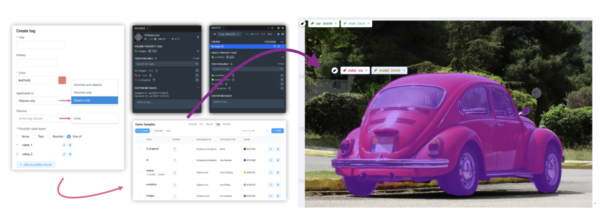
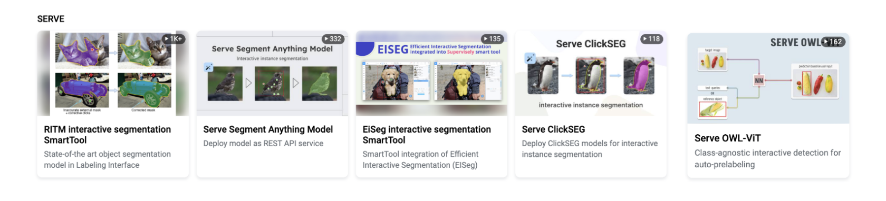

**!!!!!!!!!!!!!! Poster image**

## Intoduction

In the world of machine learning, the quest for more accurate and robust models continues to drive innovation. It is crucially important for models to recognize objects not just in standard views but in various real-world scenarios, capturing multiple perspectives to **tackle everyday challenges efficiently**.

To achieve this, multi-view image annotation is gaining considerable attention. It leverages multiple perspectives, incorporates diverse data modalities and feature spaces. This enables learning algorithms to better comprehend and generalize visual data, identifying specific object features for improved recognition accuracy.

However, the process of annotating multiple images can be time-consuming and tedious, especially when you have to switch between images to annotate them separately.

That's where **Supervisely Image Labeling Tool** comes in and solves this by providing a convenient feature to annotate multiple images on one screen without switching between tabs, saving you time and effort.

**!!!!!!!!!!!!!! GIF with multiple images on one screen**

There are two ways to annotate images in Supervisely Image Labeling Tool:

- using the SmartTool to annotate images with AI assistance ([here is the guide on how to use Smart Tool](https://supervisely.com/blog/smarttool-annotation/))
- using [Bounding Box](https://supervisely.com/blog/bounding-box-annotation-for-object-detection/), [Mask Pen](https://supervisely.com/blog/mask-pen-tool/), [Polygon](https://supervisely.com/blog/how-to-use-polygon-anotation-tool-for-image-segmentation/), [Brush](https://supervisely.com/blog/brush/), Polyline, and Graph (keypoint) for manual labeling purposes (or to easily correct some cases).

## Video tutorial

In this video tutorial, you will learn how to import images and annotate them in Supervisely Labeling Tool using grouped display. Here's what we'll cover:

1. Importing groups of images into Supervisely

2. Exploring the multi-view display functionality in the Image Labeling Tool.

3. Manually annotating groups of images.

4. Speeding up the labeling process with AI-assistance using the [Supervisely Smart Tool](https://supervisely.com/blog/smarttool-annotation/)

**!!!!!!!!!!!!!! Youtube video tutorial**

## The reason why you should use grouped display

**Highlight the problem**:
Let's say you have a dataset with 500 images (100 scenes, each with 5 images from various angles) showcasing several object classes. The task at hand – annotating all these scenes – poses a challenge in other solutions, with constant image switching and class selection proving both time-consuming and mentally taxing.

**Here's where our solution shines:**
Just group images by tag values; for our example, assign corresponding tags to all 5 images of each scene (e.g., `scene_1`, `scene_2`, `scene_3`, etc.).
By activating the Multiple Image View Mode in Supervisely Image Labeling Tool, you can annotate multiple images simultaneously on one screen.
That's it! Now it is only 100 multi-view scenes instead of 500 separate images, and you don't need to switch between images and select the desired class for each object to annotate, keeping in mind all the details about the objects you are annotating.

Look how convenient and intuitive it can be, and in this tutorial we'll learn how to use it.

**!!!!!!!!!!!!!! GIF with grouped display**

## About Tags in Supervisely

1

If you need more than a bunch of marked pixels on an image and associate some extra information with annotations or files, you can use [tags](https://docs.supervisely.com/data-organization/projects/tags). Tags are key-value pairs that can be assigned to any object or image. Tags can be used to store any information about the object, such as its name, type, or any other properties of objects or images that you want to highlight.

2

In this use case, **string-type tags are required** to group images by tag values and annotate them simultaneously on one screen.

3

 <!-- !!! change this image -->

## How to work with Multi-view images in Supervisely

Supervisely provides a convenient workflow, from import using the Application or Python SDK to annotation with the Labeling Tool, enabling viewing and annotation of images as groups. Follow the brief guide below to import grouped images and multi-view annotate them in Supervisely.

## Step 1. Prepare Images for Import

- Organize your images into a simple project structure according to the application's [overview description](https://ecosystem.supervisely.com/apps/import-images-groups?_ga=2.53824936.1042633755.1690183817-1574751671.1670221597#Overview):

```text
📦 archive.zip
 ┗ 📂 project_name
   ┗ 📂 dataset_name
     ┣ 📂 group_name_1
     ┃ ┣ 🏞️ demo1.png
     ┃ ┣ 🏞️ demo2.png
     ┃ ┗ 🏞️ demo3.png
     ┣ 📂 group_name_2
     ┃ ┣ 🏞️ demo4.png
     ┃ ┣ 🏞️ demo5.png
     ┃ ┣ 🏞️ demo6.png
     ┃ ┣ 🏞️ demo7.png
     ┃ ┣ 🏞️ demo8.png
     ┃ ┗ 🏞️ demo9.png
     ┣ 🏞️ demo10.png
     ┣ 🏞️ demo11.png
     ┣ 🏞️ demo12.png
     ┗ 🏞️ demo13.png
```

In this example, we have 2 groups of images: `group_name_1` (3 images) and `group_name_2` (6 images). When you import this project, the application will automatically assign predefined tag to these images with `group_name_1` and `group_name_2` values respectively. Then, the application will group images by these tag values. The remaining 4 images are not grouped and will be imported without any tags.

- We have prepared 🔗 [demo data](https://github.com/supervisely-ecosystem/import-images-groups/releases/download/v0.0.1/cars.catalog.zip) for you, so it will help you to quickly reproduce the tutorial without a headache and get an experience and clear understanding of all the steps in this tutorial.

## Step 2. Import Images

After preparing your images for import, follow these steps to easily import image groups into Supervisely:

<blog-app github="import-images-groups/master"></blog-app>

1. Run the [Import images groups](https://ecosystem.supervisely.com/apps/import-images-groups?utm_source=blog) application.

2. Drag and drop the archive with your Project into the [application](https://ecosystem.supervisely.com/apps/import-images-groups?utm_source=blog) or upload it into the Team Files.

3. Click the `Run` button to start the import process.


Alternatively, you can also enable multi-view in the Image Labeling Tool interface (corresponding tags should be assigned to images before):


## Step 3. Explore Multi-View Display

After importing images using the "Import images groups" app, you will see that images are grouped on the screen by tag values. Use `LEFT` and `RIGHT` arrow keys to navigate between groups.


As you can see, the images in the Labeling tool are grouped in the same way as in your images in folders (images from one folder are combined into one group). When importing, each image from the folders will be assigned tags with the same values, which allows them to be grouped into one group.

## Step 4. Multi-View Annotation

**⚡ Fast labeling with interactive AI assistance.**

Combine the power of AI and grouped displaying to annotate images faster and more efficiently. [Connect your computer with GPU](https://docs.supervisely.com/agents/connect-your-computer) and utilize popular pre-trained models for the Smart Labeling tool to improve efficiency

<!--  -->


The Smart Tool is a powerful tool that allows you to annotate images with AI assistance. It offers users the opportunity to utilize a variety of neural network algorithms integrated within the Supervisely platform. This encompasses robust models like [RITM](https://ecosystem.supervisely.com/apps/ritm-interactive-segmentation/supervisely?utm_source=blog), [Segment Anything](https://ecosystem.supervisely.com/apps/serve-segment-anything-hq/supervisely_integration/serve?utm_source=blog), and more, with ongoing efforts to enhance our [Ecosystem](https://ecosystem.supervisely.com/) through the integration of new models. It's essential to emphasize that the effectiveness, precision, and speed of segmentation are strongly influenced by the selection of the model. Therefore, we recommend that you try out different models to find the one that best suits your needs.

Read the guide on [how to use the Smart Tool](https://supervisely.com/blog/smarttool-annotation/) to annotate images with AI assistance.



You can also train your model and use it in the Smart Tool. Explore blog posts dedicated to this topic:

- [How to Train Smart Tool for Precise Cracks Segmentation in Industrial Inspection](https://supervisely.com/blog/industrial-inspection-cracks-segmentation/)
- [Automate manual labeling with custom interactive segmentation model for agricultural images](https://supervisely.com/blog/custom-smarttool-wheat/)
- [Unleash The Power of Domain Adaptation - How to Train Perfect Segmentation Model on Synthetic Data with HRDA](https://supervisely.com/blog/unleash-the-power-of-domain-adaptation-with-HRDA-synthetic-cracks-segmentation/)
- [Lessons Learned From Training a Segmentation Model On Synthetic Data](https://supervisely.com/blog/lessons-learned-from-training-a-segmentation-model-on-synthetic-data/)

**Manual annotation**

Use different tools such as [Bounding Box](https://supervisely.com/blog/bounding-box-annotation-for-object-detection/), [Mask Pen](https://supervisely.com/blog/mask-pen-tool/), [Polygon](https://supervisely.com/blog/how-to-use-polygon-anotation-tool-for-image-segmentation/), [Brush](https://supervisely.com/blog/brush/), Polyline, and Graph (keypoint) for manual labeling purposes (✔️ or to easily correct some cases).

<!--  -->


## Collaborate teamwork

How else can you speed up the annotation process?

✅ Create a team and invite your colleagues to [labeling jobs](https://docs.supervisely.com/labeling/jobs), and work together on the same project.

Check out our blog [posts](https://supervisely.com/blog/tags/collaboration/) on how to effectively perform annotation at scale using Labeling Jobs, Labeling Queues and Labeling Consensus approaches.

Labeling Jobs and other collaboration tools in Supervisely helps to organize efficient work and complete tasks like:

1. Job management - the need to describe a particular task: what kind of objects to annotate and how
2. Progress monitoring - tracking annotation status and reviewing submitted results
3. Access permissions - limiting access only to specific datasets, classes, and **tags** within a single job
4. And what's more, you can take a screenshot for urgent tasks without using additional apps and quickly share the link.

## Automate workflow with Python SDK

You can also automate the process of working with image groups using Supervisely Python SDK.

```sh
pip install supervisely
```

You can learn more about it in our [Developer Portal](https://developer.supervisely.com/getting-started/python-sdk-tutorials/images/multiview-images), but here we'll just show how you can upload your image groups with just a few lines of code.

```python
# enable multi-view display in project settings
api.project.set_multiview_settings(project_id)

images_paths = ['path/to/audi_01.png', 'path/to/audi_02.png']

# upload group of images
api.image.upload_multiview_images(dataset_id, "audi", images_paths)
```

In the example above we uploaded two groups of images.
Before or after uploading images, we also need to enable image grouping in the project settings.

There's so much you can do with them using our Python SDK! You can find a set of Python SDK tutorials to work with images on our [Developer Portal](https://developer.supervisely.com/getting-started/python-sdk-tutorials/images).

### To sum up

Supervisely Image Labeling Tool is remarkably user-friendly, requiring minimal setup to get started. Its potential for further enhancements makes it stand out among competitors, providing a truly convenient solution for diverse use cases, including multi-view image annotation.
