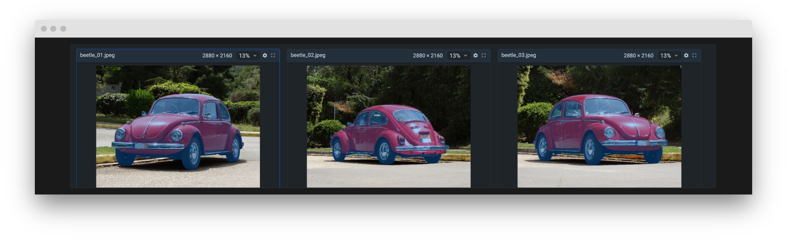

# Importance of Multi-View Image Annotation for efficient model training

As the demand for high-quality object detection, recognition, and segmentation on images increases, the need for well-annotated datasets becomes crucial. To ensure the quality and effectiveness of computer vision model training, datasets with objects captured in different states and forms, from various viewpoints, are essential. Such datasets enable learning algorithms to better comprehend and generalize visual data, as well as identify specific object features, leading to improved recognition accuracy. 

Moreover, training models on annotated images from multiple viewpoints allows them to handle real-life scenarios with diverse object placements and orientations.

✅ Multiview annotation can reduce the amount of time and money used to create the needed annotations for training images. While machine learning models must be trained using many thousands of pictures that are manually annotated, multiview annotations only requires a few pictures to be hand labeled in order to automatically label hundreds more.

# Choosing the Right Annotation Tools

For this purpose, **Supervisely's advanced labeling tool offers an additional option to group images based on a common tag**. This feature simplifies the task by displaying grouped images on a single screen grid, making **manual** and **AI-assisted** annotations more efficient.

In this brief video, I will demonstrate how to annotate multiple photos of cars from various angles obtained from an online car sales website, using a unified grid for annotation.

---- тут видео ------
<!-- <embed-youtube id="1rFeUfmT20k"></embed-youtube> -->

## Step 1. Prepare data for labeling

### Option 1. Use the **Import images groups** application and import data

- This is a more convenient way to group images if your dataset lacks annotations. 
- Organize your images into a simple project structure according to the application's overview description.
- We have prepared 🔗 [demo data](https://github.com/supervisely-ecosystem/import-images-groups/releases/download/v0.0.1/cars.catalog.zip) for you, so it will help you to quickly reproduce the tutorial without a headache and get an experience and clear understanding of all steps in this tutorial.
- You can use your own data to reproduce this tutorial.

 

    <blog-app github="import-images-groups/master"></blog-app>

### Option 2. Import labeled data and assign tags

 If you already have the labeled data — just upload it into Supervisely platform using one of the [70+ import Supervisely Apps]( https://ecosystem.supervisely.com/import) from our Ecosystem. You will find there the imports for all popular data formats in computer vision. For example, here are just a few popular import Apps from Ecosystem:

 

    <blog-app github="convert-yolov5-to-supervisely-format/master"></blog-app>
    <blog-app github="import-images-with-masks/master"></blog-app>
    <blog-app github="import-coco/master"></blog-app>

 - **Required step**: Create 1 or more tags with the `any_string` type in the project settings and assign each image with the value of the group name you want to distribute them into (tags allow us enable grouping images in labeling tool).
 > You can create multiple tags and group images as you see fit. For example, in this case, creating additional tags like "color" and "body type" works similarly to filtering on a car sales website 🗒️.

## Step 2. Explore images in the advanced Supervisely labeling tool

✨ **Supervisely advanced labeling tool** offers an intuitive interface for ease of use. Below is a brief overview.

---- тут картинка интерфейса с сеткой из картинок ----

Here's an explanation of what you see in the image:

 1. Panel featuring a button for capturing screenshots, a hotkeys map, layout settings, and history of operations.

 2. Toolbar for navigating through images and working with annotations.

 3. Workspace with the image or group of images.

 4. Tabs that list images, objects, figures, tags, and their settings.

 5. Additional display settings in the interface.

The interface is fully customizable. If you're not satisfied with the default layout of the main tabs, you can always switch to the panel variant and rearrange everything according to your convenience. This feature is often lacking in some web applications, which undoubtedly sets our tool apart in terms of usability.

## Step 3. Enable image grouping option in settings

Easily switch the option and select one of the tags you created and assigned before. Images will quickly arrange into a grid, grouped by tag values.

-- тут быстрая анимашка как включить эту опцию ----

## Step 4. Start labeling grouped images

Now your images are grouped based on specific characteristics, annotating them becomes more manageable. 

--- тут можно еще анимашку переключения между разными тэгами группировок -----

### Option 1. Fast labeling with interactive AI assistance

It is hard and time-consuming to segment objects over thousands of frames. **Smart Tool** helps you easily label the desired object in an image with just a few clicks because it is based on using various pre-trained neuron network (NN) models. All you need to do is frame the presumed object with a bounding box (bbox).

You can run multiple models simultaneously for different input data and quickly switch between them.

  1. Connect your computer with GPU
  Suppervisely allows you to connect your own computers with GPU to the platform and use them for model training, inference and evaluation ✨ **for FREE**. It is as simple as running a single command in the terminal on your machine.
   - No vendor locks. You can connect your computer from home, office or cloud.
   - Single command, no network configuration is needed.
   - Private, open-sourced, proven by the community: 🌎 **1.5M+ docker pulls**.

   Here is the video instruction that explains in detail how to do that:

   <embed-youtube id="aO7Zc4kTrVg"></embed-youtube>

  2. Deploy one of our pre-trained recognition models (your own model or models we prepared in Ecosystem).
  Here are some of popular model.

### Option 2. Manual annotation (creating rectangle, bitmap, polyline, polygon, or point)

Also, you can use shapes such as **Bitmap**, **Polygon**, and **Rectangle** for labeling purposes.

The **Polygon Tool** is used for annotating Polygon shapes on images if you don't need much precision.

It's convenient to use the **Rectangle Tool** if you only want to mark an object without defining its outline.

 --- тут ускоренная анимация как создаются 2-3 типа простых объектов (например бокс и маска) ----------

## Tags and Properties
Как вы уже заметили, это очень важно не только аннотировать данные, но и добавлять тэги, которые подсветят свойства объектов.
В данном юзкейсе тэги также упрощают задачу мульти имэдж аннотирования.

<!-- --- тут красивый скрин по тэгам  ---- -->

In data tabs, you can find and change **Properties** for objects, shapes, and volumes. For example, you can change the shape type or add a new tag, and change the layer order for overlapping objects to control their visibility.

## Collaborative teamwork

Distribute annotation work between colleagues using labeling jobs.

Labeling Jobs and other collaboration tools in Supervisely helps to organize efficient work and complete the tasks like:

1. Job management - the need to describe a particular task: what kind of objects to annotate and how

2. Progress monitoring - tracking annotation status and reviewing submitted results

3. Access permissions - limiting access only to specific datasets and classes within a single job

4. And what's more, you can take a screenshot for urgent tasks without using additional apps and quickly share the link.

## Export data

At any moment of the working process, if you want to use these results elsewhere, you can export them using one of Supervisely Apps from Ecosystem. For example, here are just a few popular export Apps from Ecosystem:

 

    <blog-app github="export-to-supervisely-format/master"></blog-app>
    <blog-app github="export-to-yolov8/master"></blog-app>
    <blog-app github="export-as-masks/master"></blog-app>
    <blog-app github="export-to-coco/master"></blog-app>
    <blog-app github="export-to-coco-mask/master"></blog-app>
    <blog-app github="export-to-pascal-voc/master"></blog-app>

## To sum up

This toolset is truly convenient and stands out among its competitors, with significant potential for further enhancements. It is remarkably user-friendly and requires minimal setup to get started.

