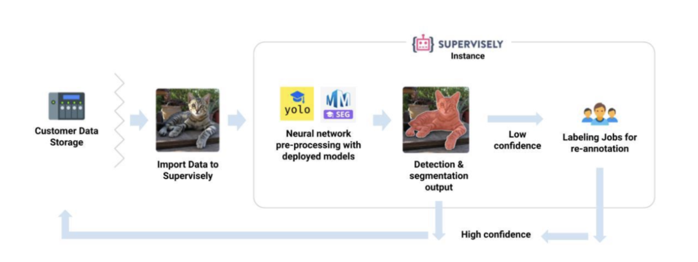

# Multi-View Image Annotation for Improving Computer Vision Model Training.

In the world of machine learning, the quest for **more accurate and robust models** continues to drive innovation. One promising approach that has gained considerable attention is **multi-view images annotation**.

It is a method that leverages multiple perspectives to **enhance the machine learning process**. By incorporating multiple perspectives, whether it's different data modalities or diverse feature spaces, multi-view image annotation enables learning algorithms to better comprehend and generalize visual data, as well as **identify specific object features**, leading to improved **recognition accuracy**.

🚀 It's crucial to train models to recognize objects not just in standard views, but in various **real-world scenarios**, capturing multiple perspectives and enabling them **to tackle everyday challenges**.

But it can be difficult to find a convenient tool in which you can annotate data from different angles without switching between tabs each time. Such a tool would significantly speed up the annotation process, as you would not have to switch to a different angle each time and search for the desired object, which would waste time, concentration, and reduce efficiency.

So, how do we get started with efficiently Multi-View Image Annotation? First, we need to choose the right annotation tools, and that's where **Supervisely's advanced labeling tool** comes in. 

In this brief video, I will demonstrate how to annotate multiple photos of cars from various angles obtained from an online car sales website, using a unified grid for annotation.

### Game-changer features of Supervisely advanced labeling tool

 
✨ Supervisely advanced labeling tool offers an intuitive interface for ease of use.
It is a powerful tool that allows you to **annotate several images on one screen** without switching between tabs, **saving you time and effort**.


All you have to do is upload your images and assign one or more tags to them.

The use of tags simplifies multi-image annotation, **enabling you to group images based on different attributes**, similar to filtering on a car sales website. 

This and many other features in our tool can be a real lifesaver when it comes to annotating data.

-- тут анимация с демой группировки + парочки других фичей тулы --

Now you can start labeling your images with the help of our advanced labeling tool.

## 🌟 Simple multi-view annotation pipeline

1. Upload your images with multiple perspective and angels.
2. Assign one or multiple tags on images and easily organize photos.
3. Annotate efficiently with AI-assistance or manual tools.

After annotating your images, you can train your models to identify objects from various angles and properties, mirroring real-life scenarios and apply pre-trained model to all images and get predictions ✅

-- заменить схему --

## Easily annotate grouped images in Supervisely advanced labeling tool

**⚡ Fast labeling with interactive AI assistance.**

It is hard and time-consuming to segment objects over thousands of frames. Smart Tool helps you easily label the desired object in an image with just a few clicks because it is based on using various pre-trained neural network (NN) models. All you need to do is frame the presumed object with a bounding box (bbox).

Run multiple models simultaneously for different input data and quickly switch between them - [connecting your computer with GPU](https://youtu.be/aO7Zc4kTrVg) and utilize popular pre-trained models for the Smart Labeling tool to improve efficiency:

✔️ Also, you can use shapes such as Bitmap, Polygon, and Rectangle for manual labeling purposes to easily correct some cases.

🤖 Once your images are annotated, you can ➡️ **train model** ➡️ **apply pre-trained model** ➡️ **obtain predictions**. 
Accurate and robust models **significantly speed up the process of annotation** objects in images.

---- (анимации процесса обучения модели и последующего применения) -----

### Use the Import images groups app to prepare data for labeling

- Organize your images into a simple project structure according to the application's [overview description](https://ecosystem.supervisely.com/apps/import-images-groups?_ga=2.53824936.1042633755.1690183817-1574751671.1670221597#Overview).

- We have prepared 🔗 [demo data](https://github.com/supervisely-ecosystem/import-images-groups/releases/download/v0.0.1/cars.catalog.zip) for you, so it will help you to quickly reproduce the tutorial without a headache and get an experience and clear understanding of all steps in this tutorial.

 

    <blog-app github="import-images-groups/master"></blog-app>

 You can create multiple tags and group images as you see fit. For example, in this case, creating additional tags like "color" and "body type" works similarly to filtering on a car sales website 🗒️ 

- Or you can use your own data to reproduce this tutorial.

If you already have the **labeled data** — just upload it into Supervisely platform using one of the [70+ import Supervisely Apps](https://ecosystem.supervisely.com/import) ✅ from our Ecosystem. There you will find the imports for all popular data formats in computer vision.

After importing data, create and **assign tags to each image you want to group**. This will simplify the task of multi-image annotation.

### About Tags

Tags are useful not only to annotate the data but also to **highlight the properties of objects or images**.
In this use case, tag feature is crucial - it simplify the task of multi-image annotation.

### Collaborative teamwork

How to organize teamwork and efficiently distribute the annotation process between colleagues? 

✅ Create a team and invite your colleagues to [labeling job](https://docs.supervisely.com/labeling/jobs), and work together on the same project.

Labeling Jobs and other collaboration tools in Supervisely helps to organize efficient work and complete the tasks like:

1. Job management - the need to describe a particular task: what kind of objects to annotate and how
2. Progress monitoring - tracking annotation status and reviewing submitted results
3. Access permissions - limiting access only to specific datasets and classes within a single job
4. And what's more, you can take a screenshot for urgent tasks without using additional apps and quickly share the link.

### To sum up

Supervisely's toolset is remarkably user-friendly, requiring minimal setup to get started. Its potential for further enhancements makes it stand out among competitors, providing a truly convenient solution for multi-view image annotation and computer vision model training.
