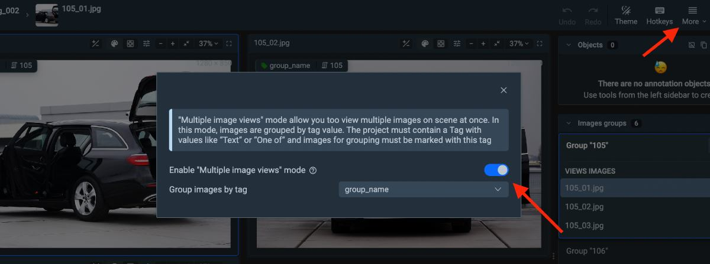

**!!!!!!!!!!!!!! Poster image**

## Intoduction

In the world of machine learning, the quest for more accurate and robust models continues to drive innovation. It is crucially important for models to recognize objects not just in standard views but in various real-world scenarios, capturing multiple perspectives to **tackle everyday challenges efficiently**.

To achieve this, multi-view image annotation is gaining considerable attention. It leverages multiple perspectives, incorporates diverse data modalities and feature spaces. This enables learning algorithms to better comprehend and generalize visual data, identifying specific object features for improved recognition accuracy.

However, the process of annotating multiple images can be time-consuming and tedious, especially when you have to switch between images to annotate each image separately.

That's where **Supervisely Image Labeling Tool** comes in and solves this by providing a convenient feature to annotate multiple images on one screen without switching between tabs, saving you time and effort.

**!!!!!!!!!!!!!! GIF with multiple images on one screen**

Both manual and AI-assisted annotation tools are available in Supervisely Image Labeling Tool, allowing you to annotate images in a variety of ways:

- use the Smart Tool to annotate images with AI assistance ([here is the guide how to use Smart Tool](https://supervisely.com/blog/smarttool-annotation/))
- use different tools such as [Bounding Box](https://supervisely.com/blog/bounding-box-annotation-for-object-detection/), [Mask Pen](https://supervisely.com/blog/mask-pen-tool/), [Polygon](https://supervisely.com/blog/how-to-use-polygon-anotation-tool-for-image-segmentation/), [Brush](https://supervisely.com/blog/brush/), Polyline, and Graph (keypoint) for manual labeling purposes (or to easily correct some cases).

## Video tutorial

In this video tutorial, you will learn how to import images and label them in Supervisely Labeling Tool using grouped display. Here's what we'll cover:

1. Importing groups of images into Supervisely

2. Exploring the multi-view display functionality in the Image Labeling Tool.

3. Manually annotating group of images.

4. Speeding up the labeling process with AI-assistance using the [Supervisely Smart Tool](https://supervisely.com/blog/smarttool-annotation/)

**!!!!!!!!!!!!!! Youtube video tutorial**

## The reason why you should use grouped display

Just imagine you have a dataset of scenes with different angles and perspectives. For example, there are 5-10 images for each scene in the dataset (from multiple perspectives). Each image contains several objects of different classes. You need to annotate all of them, but it is time-consuming to switch between images and select the desired class for each object to annotate. Moreover, it is hard to keep in mind all the details about objects you are annotating.

Here is the solution: group images by tags and annotate them simultaneously on one screen. It will save you time and effort.

<!-- Here is two options how you can simplify and speed up the annotation process:
    - Group images on one screen
    - Collaborate with your team and distribute the annotation process between colleagues

Both of these options you can easily use at the same time to label your data simultaneously and efficiently. -->

**!!!!!!!!!!!!!! GIF with grouped display**


It requires to assign tags to images before using grouped display (below you can find the detailed instruction how to do it).


## About Tags in Supervisely

If you need more than a bunch of marked pixels on an image and associate some extra information with annotations or files, you can use [tags](https://docs.supervisely.com/data-organization/projects/tags). Tags are key-value pairs that can be assigned to any object or image. Tags can be used to store any information about the object, such as its name, type, or any other properties of objects or images that you want to highlight.

In this use case, **string type tags are required** to group images by tags and annotate them simultaneously on one screen.

 <!-- !!! change this image -->

## How to annotate grouped images in Supervisely

🌟 Simple multi-view annotation pipeline:

1. Prepare images for import.
2. Import images using [Import images groups](https://ecosystem.supervisely.com/apps/import-images-groups?utm_source=blog) app. It will automatically assign tags and group images by these tags. (Alternatively, you can manually upload images and assign string type tag to each image you want to group).
3. Annotate efficiently with AI-assistance or manual tools.

## Step 1. Prepare Images for Import

- Organize your images into a simple project structure according to the application's [overview description](https://ecosystem.supervisely.com/apps/import-images-groups?_ga=2.53824936.1042633755.1690183817-1574751671.1670221597#Overview):

```text
📦 archive.zip
 ┗ 📂 project_name
   ┗ 📂 dataset_name
     ┣ 📂 group_name_1
     ┃ ┣ 🏞️ demo1.png
     ┃ ┣ 🏞️ demo2.png
     ┃ ┗ 🏞️ demo3.png
     ┣ 📂 group_name_2
     ┃ ┣ 🏞️ demo4.png
     ┃ ┣ 🏞️ demo5.png
     ┃ ┣ 🏞️ demo6.png
     ┃ ┣ 🏞️ demo7.png
     ┃ ┣ 🏞️ demo8.png
     ┃ ┗ 🏞️ demo9.png
     ┣ 🏞️ demo10.png
     ┣ 🏞️ demo11.png
     ┣ 🏞️ demo12.png
     ┗ 🏞️ demo13.png
```

In this example, we have 2 groups of images: `group_name_1` (3 images) and `group_name_2` (6 images). When you import this project, the application will automatically assign predefined tag to these images with `group_name_1` and `group_name_2` values respectively. Then, the application will group images by these tag values. The remaining 4 images are not grouped and will be imported without any tags.

- We have prepared 🔗 [demo data](https://github.com/supervisely-ecosystem/import-images-groups/releases/download/v0.0.1/cars.catalog.zip) for you, so it will help you to quickly reproduce the tutorial without a headache and get an experience and clear understanding of all steps in this tutorial.

## Step 2. Import Images

After preparing your images for import, follow these steps to easily import images groups into Supervisely:

<blog-app github="import-images-groups/master"></blog-app>

1. Run the [Import images groups](https://ecosystem.supervisely.com/apps/import-images-groups?utm_source=blog) application.

2. Drag and drop the archive with your Project into the [application](https://ecosystem.supervisely.com/apps/import-images-groups?utm_source=blog) or upload it into the Team Files.

3. Click the `Run` button to start the import process.


## Step 3. Explore Multi-View Display and Easily Annotate Grouped Images

After importing images by Import images groups app, you will see that images are grouped by tags and displayed on one screen. If you want to change the group settings, you can do it in the project settings or right in the Image Labeling Tool.



**⚡ Fast labeling with interactive AI assistance.**

Combine the power of AI and grouped displaying to annotate images faster and more efficiently. [Connect your computer with GPU](https://docs.supervisely.com/agents/connect-your-computer) and utilize popular pre-trained models for the Smart Labeling tool to improve efficiency

The Smart Tool is a powerful tool that allows you to annotate images with AI assistance. It offers users the opportunity to utilize a variety of neural network algorithms integrated within the Supervisely platform. This encompasses robust models like [RITM](https://ecosystem.supervisely.com/apps/ritm-interactive-segmentation/supervisely?utm_source=blog), [Segment Anything](https://ecosystem.supervisely.com/apps/serve-segment-anything-hq/supervisely_integration/serve?utm_source=blog), and more, with ongoing efforts to enhance our [Ecosystem](https://ecosystem.supervisely.com/) through the integration of new models. It's essential to emphasize that the effectiveness, precision, and speed of segmentation are strongly influenced by the selection of the model. Therefore, we recommend that you try out different models to find the one that best suits your needs.

Read the guide on [how to use the Smart Tool](https://supervisely.com/blog/smarttool-annotation/) to annotate images with AI assistance.


You can also train your own model and use it in the Smart Tool. Explore blog posts dedicated to this topic:

- [How to Train Smart Tool for Precise Cracks Segmentation in Industrial Inspection](https://supervisely.com/blog/industrial-inspection-cracks-segmentation/)
- [Automate manual labeling with custom interactive segmentation model for agricultural images](https://supervisely.com/blog/custom-smarttool-wheat/)
- [Unleash The Power of Domain Adaptation - How to Train Perfect Segmentation Model on Synthetic Data with HRDA](https://supervisely.com/blog/unleash-the-power-of-domain-adaptation-with-HRDA-synthetic-cracks-segmentation/)
- [Lessons Learned From Training a Segmentation Model On Synthetic Data](https://supervisely.com/blog/lessons-learned-from-training-a-segmentation-model-on-synthetic-data/)


**Manual annotation tools**

Use different tools such as [Bounding Box](https://supervisely.com/blog/bounding-box-annotation-for-object-detection/), [Mask Pen](https://supervisely.com/blog/mask-pen-tool/), [Polygon](https://supervisely.com/blog/how-to-use-polygon-anotation-tool-for-image-segmentation/), [Brush](https://supervisely.com/blog/brush/), Polyline, and Graph (keypoint) for manual labeling purposes (✔️ or to easily correct some cases).


## Step 4 (optional). Collaborate teamwork

How else can you speed up the annotation process?

✅ Create a team and invite your colleagues to [labeling job](https://docs.supervisely.com/labeling/jobs), and work together on the same project.

Labeling Jobs and other collaboration tools in Supervisely helps to organize efficient work and complete the tasks like:

1. Job management - the need to describe a particular task: what kind of objects to annotate and how
2. Progress monitoring - tracking annotation status and reviewing submitted results
3. Access permissions - limiting access only to specific datasets, classes, **tags** within a single job
4. And what's more, you can take a screenshot for urgent tasks without using additional apps and quickly share the link.

### To sum up

Supervisely Image Labeling Tool is remarkably user-friendly, requiring minimal setup to get started. Its potential for further enhancements makes it stand out among competitors, providing a truly convenient solution for diverse use cases, including multi-view image annotation.
