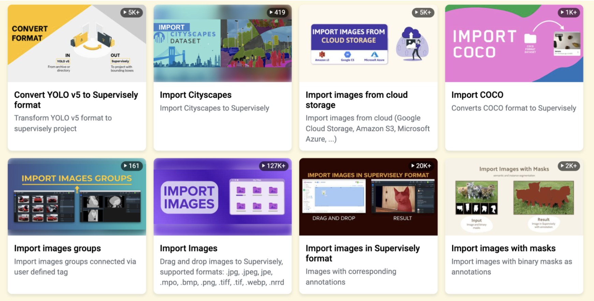
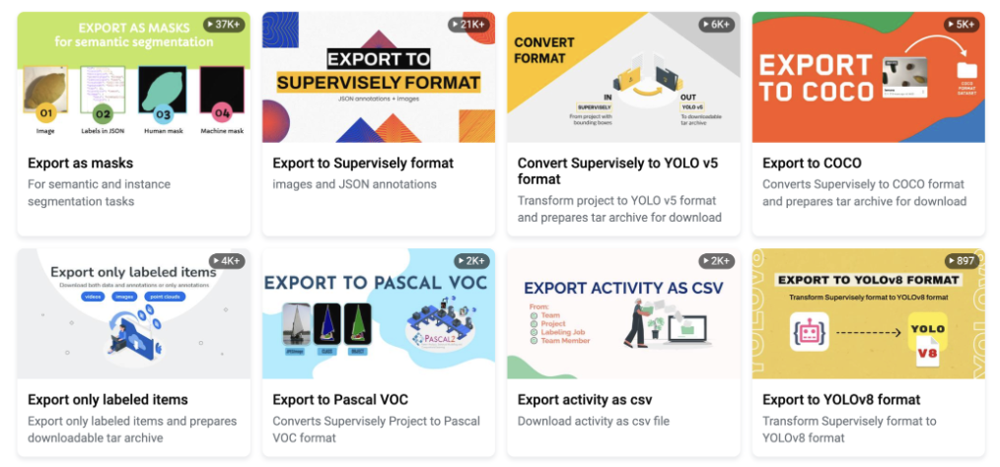

# Multi-View Image Annotation for Improving Computer Vision Model Training.

In the world of machine learning, the quest for **more accurate and robust models** continues to drive innovation. One promising approach that has gained considerable attention is **multi-view images annotation**.

It is a method that leverages multiple perspectives to **enhance the machine learning process**. By incorporating multiple perspectives, whether it's different data modalities or diverse feature spaces, multi-view learning enables us to uncover hidden patterns, improve accuracy, and boost the performance of machine learning models.

🚀 It's crucial to train models to recognize objects not just in standard views, but in various **real-world scenarios**, capturing multiple perspectives and enabling them **to tackle everyday challenges**.

## 🌟 Simple multi-view annotation pipeline

1. Upload your images with multiple perspective and angels images
2. Assign one or multiple tags on images and easily organize photos.
3. Efficiently AI-assisted or manual annotation.
4. Train your models to identify objects from various angles and properties, mirroring real-life scenarios.
5. Apply pre-trained model to all images and get predictions ✅

In this brief video, I will demonstrate how to annotate multiple photos of cars from various angles obtained from an online car sales website, using a unified grid for annotation.

## Easily annotate grouped images in Supervisely labeling tool

**Fast labeling with interactive AI assistance ⚡**

It is hard and time-consuming to segment objects over thousands of frames. Smart Tool helps you easily label the desired object in an image with just a few clicks because it is based on using various pre-trained neuron network (NN) models. All you need to do is frame the presumed object with a bounding box (bbox).

Also, you can use shapes such as Bitmap, Polygon, and Rectangle for manual labeling purposes for easily correct some cases ✅.

Once your images are annotated, you can train model, apply pre-trained model weights and obtain predictions.

---- (анимации процесса обучения модели и последующего применения) -----

Run multiple models simultaneously for different input data and quickly switch between them - [connecting your computer with GPU](https://youtu.be/aO7Zc4kTrVg) and utilize popular pre-trained models for the Smart Labeling tool to improve efficiency.

### Use the Import images groups app and prepare data for labeling.

- Organize your images into a simple project structure according to the application's [overview description](https://ecosystem.supervisely.com/apps/import-images-groups?_ga=2.53824936.1042633755.1690183817-1574751671.1670221597#Overview).

- We have prepared 🔗 [demo data](https://github.com/supervisely-ecosystem/import-images-groups/releases/download/v0.0.1/cars.catalog.zip) for you, so it will help you to quickly reproduce the tutorial without a headache and get an experience and clear understanding of all steps in this tutorial.

 

    <blog-app github="import-images-groups/master"></blog-app>

 You can create multiple tags and group images as you see fit. For example, in this case, creating additional tags like "color" and "body type" works similarly to filtering on a car sales website 🗒️ 

- Or you can use your own data to reproduce this tutorial.

If you already have the labeled data — just upload it into Supervisely platform using one of the [70+ import Supervisely Apps](https://ecosystem.supervisely.com/import) ✅from our Ecosystem. You will find there the imports for all popular data formats in computer vision. For example, here are just a few popular import Apps from Ecosystem:

    <blog-app github="convert-yolov5-to-supervisely-format/master"></blog-app>
    <blog-app github="import-images-with-masks/master"></blog-app>
    <blog-app github="import-coco/master"></blog-app>

After importing data, create and **assign tags to each image you want to group**. This will simplify the task of multi-image annotation.

### Game-changer features of Supervisely advanced labeling tool

The interface is fully customizable. If you're not satisfied with the default layout of the main tabs, you can always switch to the panel variant and rearrange everything according to your convenience. This feature is often lacking in some web applications, which undoubtedly sets our tool apart in terms of usability.

 ✨ Supervisely advanced labeling tool offers an intuitive interface for ease of use. 

### About Tags

Tags are useful not only to annotate the data but also to **highlight the properties of objects or images**.
In this use case, tag feature is crucial - it simplify the task of multi-image annotation.

### Collaborative teamwork

Distribute annotation work between colleagues using [labeling jobs](https://docs.supervisely.com/labeling/jobs).

Labeling Jobs and other collaboration tools in Supervisely helps to organize efficient work and complete the tasks like:

1. Job management - the need to describe a particular task: what kind of objects to annotate and how
2. Progress monitoring - tracking annotation status and reviewing submitted results
3. Access permissions - limiting access only to specific datasets and classes within a single job
4. And what's more, you can take a screenshot for urgent tasks without using additional apps and quickly share the link.

### Export data

At any moment of the working process, if you want to use these results elsewhere, you can export them using one of Supervisely Apps from Ecosystem. For example, here are just a few popular export Apps from Ecosystem:

 

    <blog-app github="export-to-supervisely-format/master"></blog-app>
    <blog-app github="export-to-yolov8/master"></blog-app>
    <blog-app github="export-as-masks/master"></blog-app>
    <blog-app github="export-to-coco/master"></blog-app>
    <blog-app github="export-to-coco-mask/master"></blog-app>
    <blog-app github="export-to-pascal-voc/master"></blog-app>

### To sum up

Supervisely's toolset is remarkably user-friendly, requiring minimal setup to get started. Its potential for further enhancements makes it stand out among competitors, providing a truly convenient solution for multi-view image annotation and computer vision model training.
